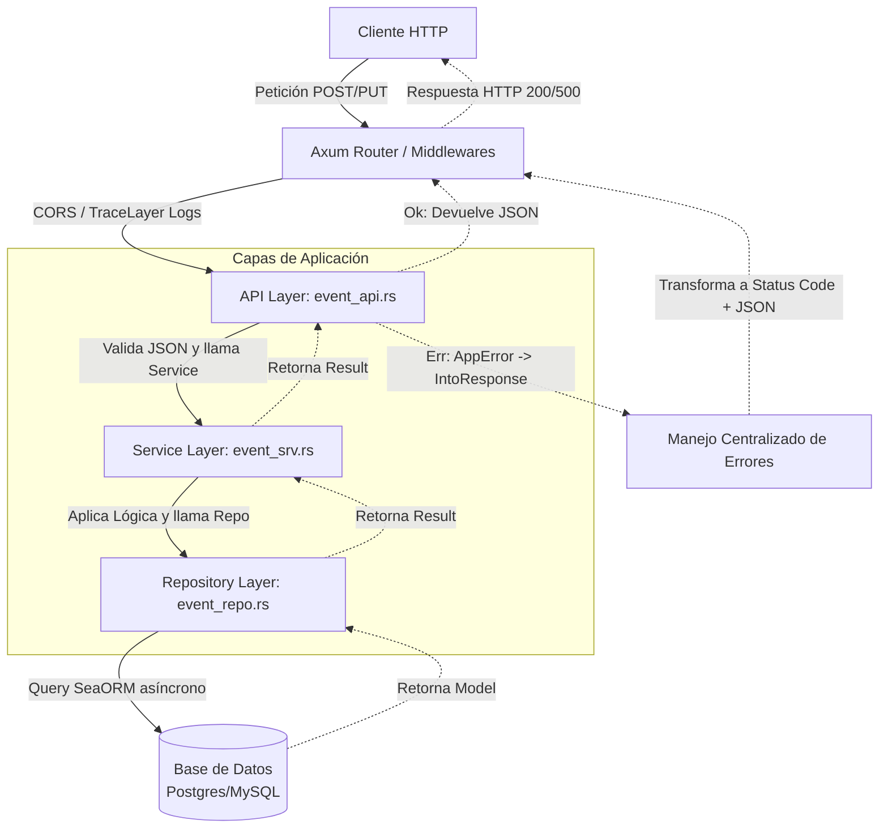

# Arquitectura del Sistema: Event Management API

## Diseño General

El proyecto sigue una **Arquitectura en Capas** estricta, con separación de responsabilidades.

Dependencias principales:

- **Axum:** Framework web asíncrono para el enrutamiento y manejo HTTP.
- **SeaORM:** ORM asíncrono y agnóstico a la base de datos.
- **Tokio:** Runtime asíncrono.
- **Tower:** Para middlewares (CORS, Tracing/Logs).

## Organización de Directorios

```text
src/
├── main.rs          # Punto de entrada. Inicializa Tracing, Configuración, BD y Router de Axum.
├── config.rs        # Centralización tipada de las variables de entorno (.env).
├── core/            # Utilidades base del sistema.
│   ├── mod.rs
│   └── error.rs     # Manejo de errores centralizado (AppError) que implementa IntoResponse.
├── api/             # Capa de Presentación (Controladores Axum).
│   ├── mod.rs
│   └── event_api.rs # Endpoints (Rutas HTTP). Inyecta AppState.
├── service/         # Capa de Lógica de Negocio. 
│   ├── mod.rs
│   └── event_srv.rs # Reglas de negocio, validaciones y orquestación. No conoce sobre HTTP.
├── repository/      # Capa de Acceso a Datos.
│   ├── mod.rs
│   └── event_repo.rs # Consultas a la base de datos usando SeaORM.
└── model/           # Entidades y Transferencia de Datos.
    ├── mod.rs
    ├── event.rs     # Entidades de la base de datos.
    └── dtos.rs      # Data Transfer Objects (Payloads JSON de entrada/salida).

tests/
├── common/          # Utilidades para pruebas de integración (setup de base de datos, etc.).
└── event_api_test.rs # Pruebas de integración que simulan peticiones a la API.
```

## Conexión a Múltiples Bases de Datos

El `AppState` inyectado a los controladores de Axum posee la capacidad de orquestar conexiones a múltiples motores de base de datos simultáneamente, abstraídos por SeaORM:

```rust
pub struct AppState {
    pub db: DatabaseConnection, // Ej. principal para PostgreSQL
    pub ticket_db: Option<DatabaseConnection>, // Opcional, puede conectarse a MySQL
}
```

SeaORM encapsula el motor (`DatabaseConnection`), el sistema puede comunicarse con PostgreSQL, MySQL o SQLite activando el respectivo feature (`sqlx-postgres`, `sqlx-mysql`) en `Cargo.toml`. La arquitectura del código en `repository` no cambia.

## Diagrama de Flujo de una Petición HTTP


