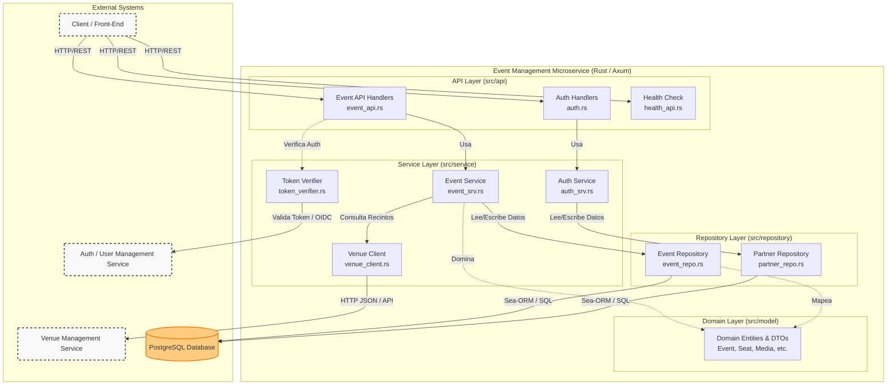

# Diagrama de Componentes: Event Management Microservice

Basado en la estructura del código en la carpeta `src` y la documentación provista (`README.md` y `Cargo.toml`), he generado un diagrama de componentes que ilustra la arquitectura de la aplicación. 

El proyecto sigue una arquitectura por capas (Layered Architecture) o Clean Architecture, típicamente implementada en aplicaciones web robustas con Rust (usando Axum y Sea-ORM).

## Descripción de Capas y Componentes

1. **API Layer (`src/api`)**:
   - Expone los endpoints HTTP RESTful del microservicio utilizando el framework web **Axum**.
   - Encamina las peticiones de los clientes a los servicios correspondientes (`event_api`, `auth`, `health_api`).

2. **Service Layer (`src/service`)**:
   - Contiene la lógica de negocio y las reglas de dominio.
   - `Event Service`: Orquesta la creación de eventos, la asignación de mapas de asientos y la publicación de eventos.
   - `Auth Service`: Maneja lógicas locales de autenticación (probablemente para 'partners' o promotores).
   - `Token Verifier`: Se encarga de la validación de tokens de seguridad (JWT) comunicándose o verificando firmas del `Auth / User Management Service` externo.
   - `Venue Client`: Cliente HTTP (probablemente implementado con `reqwest`) para comunicarse con el subdominio externo de `VenueManagement`.

3. **Repository Layer (`src/repository`)**:
   - Capa de acceso a datos utilizando el ORM **Sea-ORM**.
   - Aísla la base de datos subyacente (PostgreSQL) de la lógica de negocio, proporcionando interfaces de consulta (CRUD) para Eventos, Asientos y Socios/Partners.

4. **Domain Layer (`src/model`)**:
   - Contiene las entidades principales y agregados descritos en el DDD (`Event`, `Seat`, `EventSchedule`, `EventMedia`, `EventSale`).
   - Define los **DTOs** (Data Transfer Objects) para la serialización de datos de entrada/salida.

5. **External Systems**:
   - **PostgreSQL**: Almacén persistente de la información del microservicio.
   - **Auth Service**: Servicio de identidad transversal que maneja los usuarios finales (fans) y usuarios de backstage (organizers).
   - **Venue Service**: Servicio que provee la información física y el trazado del recinto ("mapa de asientos").
