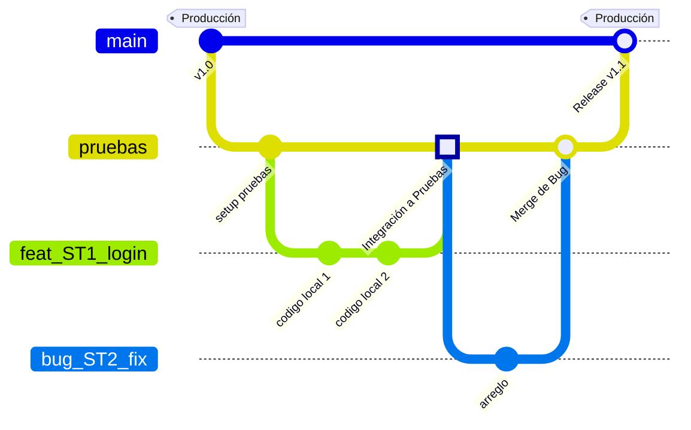

# Procesos de brancheo y commits

## Nomenclatura

### tipos

- **core:** Actividades relacionadas con documentacion o configuraciones del entorno que no estan directamente relacionadas con codigo.
- **bug:** Cambios de funcionalidad, correcciones, o solucion de problemas.
- **feat:** Funcionalidades, implementaciones de nuevos requisitos o refactorizacion de código.

### identificadores

los identificadores se encuentran en la tabla de excel donde estan asignadas las tareas del proyecto


### nombrar nueva branch

Para cada nueva asignacion se genera una nueva branch con el formato

```bash
git checkout -b tipo_identificador_descripcionCorta(opcional)
```

ejemplo:

```bash
git checkout -b core_ST2_inicializarHerramientas
```

### casos especiales

En caso de que una actividad no esté relacionada necesariamente con una tarea del Excel (por ejemplo, arreglar una cosa rápida en un documento), se utilizará el identificador `NA` (Not Applicable).

ejemplo:

```bash
git checkout -b core_NA_actualizarReadme
```

### guia de commits

Los mensajes de commit deben mantener la uniformidad y trazabilidad. El formato recomendado es:
`tipo(identificador): descripción breve` (ej. `feat(ST1): implementar endpoint de login`).

El cuerpo del commit debe incluir (si aplica):

- archivos modificados principales
- resultado de la implementación
- cualquier nota importante para el reviewer

### Flujo de Trabajo (Entornos)

El proyecto utiliza una estrategia basada en tres entornos principales, alineados directamente con nuestras ramas en Git:

1. **Local (Desarrollo):**
   - Aquí se escribe el código.
   - **Ramas:** Las creadas a partir de tickets (`feat_...`, `bug_...`, `core_...`).
   - Al terminar la tarea, se envía un Pull Request hacia la rama de `pruebas`.
2. **Pruebas (Testing / QA):**
   - **Rama:** `pruebas`
   - Entorno intermedio. Aquí se junta el código de todos los desarrolladores para verificar que nada se haya roto al integrarse.
3. **Producción (Main):**
   - **Rama:** `main`
   - Entorno en vivo para los usuarios finales. Solo recibe código (Merge) directamente desde la rama `pruebas` una vez que la versión ha sido validada. Nunca se desarrolla directamente sobre esta rama.

### Diagrama de Brancheo


