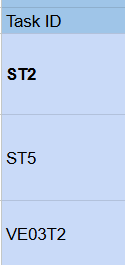
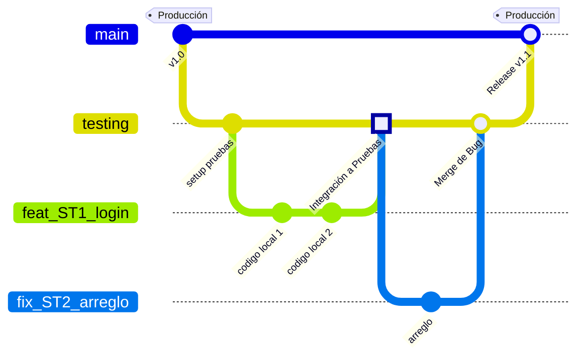

# Procesos de brancheo y commits

## Nomenclatura

### tipos

Los tipos son los de [Conventional Commits](https://www.conventionalcommits.org/) y son los únicos que acepta el hook `commit-msg` (ver `commitlint.config.js`):

- **feat:** Funcionalidades o implementaciones de nuevos requisitos.
- **fix:** Correcciones o solución de problemas.
- **docs:** Cambios solo de documentación.
- **style:** Formato del código, sin cambios de comportamiento.
- **refactor:** Reestructuración del código, sin cambios de comportamiento.
- **perf:** Mejoras de rendimiento.
- **test:** Agregar o corregir pruebas.
- **chore:** Configuración del entorno o tareas de mantenimiento que no cambian el código de la aplicación.
- **ci:** Cambios en los workflows de CI o scripts de release.
- **build:** Cambios en dependencias, Dockerfile o el sistema de build.

Los tipos `core` y `bug` que se usaban antes ya no son válidos: usa `chore` y `fix`.

### identificadores

los identificadores se encuentran en la tabla de excel donde estan asignadas las tareas del proyecto



### nombrar nueva branch

Para cada nueva asignacion se genera una nueva branch con el formato

```bash
git checkout -b tipo_identificador_descripcionCorta(opcional)
```

ejemplo:

```bash
git checkout -b chore_ST2_inicializarHerramientas
```

### casos especiales

En caso de que una actividad no esté relacionada necesariamente con una tarea del Excel (por ejemplo, arreglar una cosa rápida en un documento), se utilizará el identificador `NA` (Not Applicable).

ejemplo:

```bash
git checkout -b docs_NA_actualizarReadme
```

### guia de commits

Los mensajes de commit deben mantener la uniformidad y trazabilidad. El formato recomendado es:
`tipo(identificador): descripción breve` (ej. `feat(ST1): implementar endpoint de login`).

El identificador es obligatorio y solo puede contener mayúsculas, números, `_` y `-` (ej. `VE05T1`, `NA`). La descripción no termina en punto. El hook `commit-msg` rechaza cualquier mensaje que no cumpla este formato.

El cuerpo del commit debe incluir (si aplica):

- archivos modificados principales
- resultado de la implementación
- cualquier nota importante para el reviewer

### Flujo de Trabajo (Entornos)

El proyecto utiliza una estrategia basada en tres entornos principales, alineados directamente con nuestras ramas en Git:

1. **Local (Desarrollo):**
   - Aquí se escribe el código.
   - **Ramas:** Las creadas a partir de tickets (`feat_...`, `fix_...`, `chore_...`, etc.).
   - Al terminar la tarea, se envía un Pull Request hacia la rama `testing`.
2. **Pruebas (Testing / QA):**
   - **Rama:** `testing`
   - Entorno intermedio. Aquí se junta el código de todos los desarrolladores para verificar que nada se haya roto al integrarse.
3. **Producción (Main):**
   - **Rama:** `main`
   - Entorno en vivo para los usuarios finales. Solo recibe código (Merge) mediante Pull Request desde la rama `testing` una vez que la versión ha sido validada. Nunca se desarrolla directamente sobre esta rama.

### Diagrama de Brancheo


```mermaid
gitGraph
    commit id: "v1.0" tag: "Producción"
    
    %% Se crea el entorno de pruebas
    branch testing
    checkout testing
    commit id: "setup pruebas"
    
    %% Un desarrollador inicia una tarea local
    branch feat_ST1_login
    checkout feat_ST1_login
    commit id: "codigo local 1"
    commit id: "codigo local 2"
    
    %% Se integra a pruebas
    checkout testing
    merge feat_ST1_login id: "Integración a Pruebas" type: HIGHLIGHT
    
    %% Otro desarrollador inicia un bugfix
    branch fix_ST2_arreglo
    checkout fix_ST2_arreglo
    commit id: "arreglo"
    
    %% Se integra a pruebas
    checkout testing
    merge fix_ST2_arreglo id: "Merge de Bug"
    
    %% Tras probar todo exitosamente, se lanza a producción
    checkout main
    merge testing id: "Release v1.1" tag: "Producción"
```
